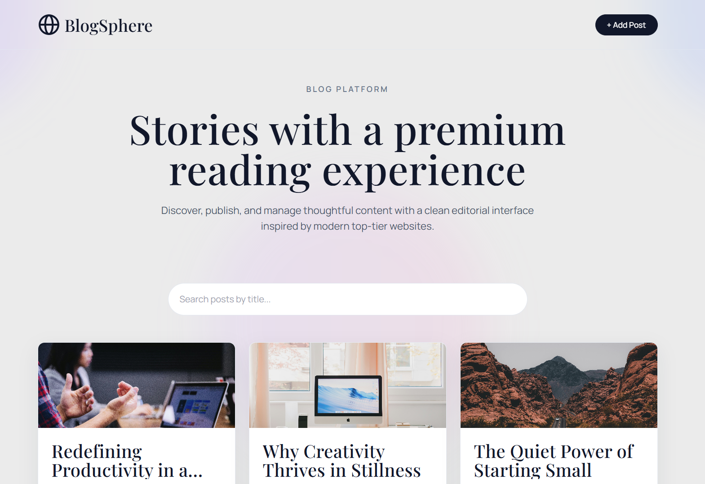

<div align="center">

# BlogSphere

**A Modern, Production-Ready Blog Application**

<p align="center">
  
</p>

**[Live Demo](https://blogsphere.sunscar.dev)** | **[Report Bug](https://github.com/Sunscarsonys/blogsphere/issues)**



</div>

---

## Table of Contents

- [Overview](#overview)
- [Features](#features)
- [Tech Stack](#tech-stack)
- [Project Structure](#project-structure)
- [Redux vs Context API](#redux-vs-context-api)
- [Local Setup](#local-setup)
- [Deployment](#deployment)
- [Assumptions](#assumptions)

---

## Overview

**BlogSphere** is a feature-rich single-page blog application built with modern React technologies. It demonstrates best practices in state management by combining Redux Toolkit for application state and React Context API for UI concerns.

**Production URL:** [https://www.blogsphere.sunscar.dev](https://blogsphere.sunscar.dev)

---

## Features

- **CRUD Operations**: Create, read, update, and delete blog posts
- **Like System**: Engage with posts through likes
- **Search & Sort**: Search posts by title
- **Persistent Storage**: Data saved to localStorage
- **Responsive Design**: Adaptive grid layout (1/2/3 columns)
- **Toast Notifications**: Real-time feedback for user actions
- **Form Validation**: Client-side input validation
- **404 Handling**: Graceful error page for invalid routes

---

## Tech Stack

| Technology       | Version | Purpose                   |
| ---------------- | ------- | ------------------------- |
| React            | 19.2.5  | UI component library      |
| Redux Toolkit    | 2.11.2  | Global state management   |
| React Router DOM | 7.14.2  | Client-side routing       |
| Vite             | 8.0.10  | Build tool and dev server |
| Tailwind CSS     | 3.4.17  | Utility-first styling     |
| ESLint           | 10.2.1  | Code linting              |

---

## Project Structure

```
src/
├── app/store.js              # Redux store configuration
├── components/               # Reusable UI components
│   ├── BackButton.jsx
│   ├── BlogCard.jsx
│   ├── BlogDetails.jsx
│   ├── BlogForm.jsx
│   ├── BlogList.jsx
│   └── Navbar.jsx
├── context/
│   └── NotificationContext.jsx   # Toast notification system
├── features/posts/
│   └── postsSlice.js         # Redux slice for posts
├── pages/                    # Route-level components
│   ├── AddPost.jsx
│   ├── EditPost.jsx
│   ├── Home.jsx
│   ├── NotFound.jsx
│   └── PostDetails.jsx
├── utils/localStorage.js     # Storage utilities
├── App.jsx
└── main.jsx
```

---

## Redux vs Context API

This application uses both Redux Toolkit and Context API for their optimal use cases:

### Redux Toolkit - Application State

Used for **Blog Posts Management** (CRUD operations, likes, persistence).

```javascript
// src/features/posts/postsSlice.js
const postsSlice = createSlice({
  name: "posts",
  initialState: { posts: loadPostsFromStorage() },
  reducers: { addPost, updatePost, deletePost, likePost },
});
```

**Why Redux?**

- Complex state logic with multiple operations
- Cross-component data access (Home, PostDetails, EditPost)
- Predictable updates via single source of truth
- DevTools support for debugging

### Context API - UI State

Used for **Toast Notifications** (ephemeral, auto-dismissing messages).

```javascript
// src/context/NotificationContext.jsx
const showToast = useCallback((message, type = "success") => {
  // Add toast → Auto-remove after 2.2 seconds
}, []);
```

**Why Context?**

- Simple, ephemeral state (no persistence needed)
- Lightweight with minimal boilerplate
- Isolated from business logic

### Summary

| Redux Toolkit     | Context API          |
| ----------------- | -------------------- |
| Blog Posts (CRUD) | Toast Notifications  |
| Like Counts       | UI Feedback Messages |
| Persistent Data   | Ephemeral State      |
| localStorage sync | Auto-dismiss (2.2s)  |

---

## Local Setup

### Prerequisites

- Node.js v18.0.0+
- npm v9.0.0+ or yarn
- Git

### Installation

```bash
# Clone repository
git clone https://github.com/Sunscarsonys/blogsphere.git
cd blogsphere

# Install dependencies
npm install

# Start development server
npm run dev
```

Open [http://localhost:5173](http://localhost:5173) in your browser.

### Available Scripts

| Command           | Description              |
| ----------------- | ------------------------ |
| `npm run dev`     | Start development server |
| `npm run build`   | Create production build  |
| `npm run preview` | Preview production build |
| `npm run lint`    | Run ESLint checks        |

---

## Deployment

### Azure Static Web Apps

1. **Create Static Web App** in [Azure Portal](https://portal.azure.com)
2. **Connect GitHub repository**
3. **Configure build settings:**
   - App location: `/`
   - Output location: `dist`
4. **Custom Domain:** Configure DNS CNAME to point to Azure

Azure automatically deploys on every push to the main branch.

**Production URL:** [https://www.blogsphere.sunscar.dev](https://www.blogsphere.sunscar.dev)

---

## Assumptions

### Data & Storage

- localStorage used for persistence (no backend required)
- Single-user, client-side only application
- ~5MB localStorage limit sufficient for text-based posts

### User Experience

- Modern browser with ES6+ and localStorage support
- JavaScript enabled
- Desktop-first design with mobile responsiveness

### Technical Decisions

- No authentication (focus on core blog functionality)
- No backend API (demonstrates frontend architecture)
- Images via external URLs only
- Toast notifications auto-dismiss after 3 seconds

---

## License

This project is open source and available under the [MIT License](LICENSE).

---

<div align="center">

**Built with React, Redux Toolkit & Tailwind CSS**  
**Developed by <a href="https://www.sunscar.dev" target="_blank">Sanskar Soni</a>**

</div>
